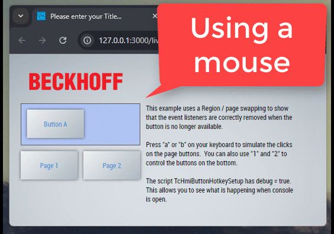
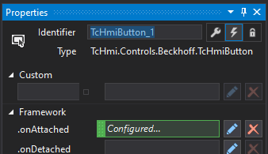
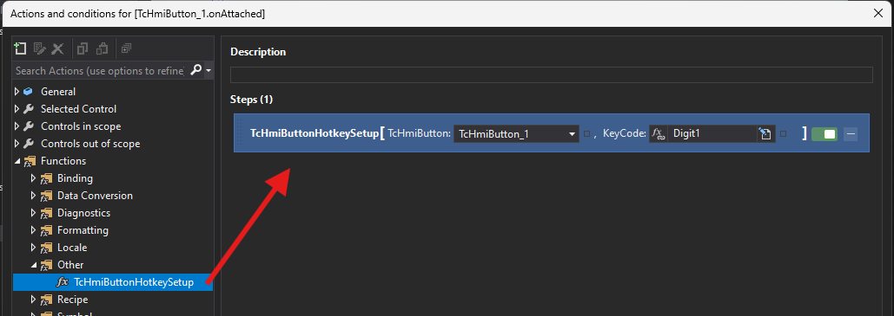

# Proof of concept, add keyboard shortcuts to TcHmiButtons

## Disclaimer

This is a personal guide not a peer reviewed journal or a sponsored publication. We make
no representations as to accuracy, completeness, correctness, suitability, or validity of any
information and will not be liable for any errors, omissions, or delays in this information or any
losses injuries, or damages arising from its display or use. All information is provided on an as
is basis. It is the reader’s responsibility to verify their own facts.

The views and opinions expressed in this guide are those of the authors and do not
necessarily reflect the official policy or position of any other agency, organization, employer or
company. Assumptions made in the analysis are not reflective of the position of any entity
other than the author(s) and, since we are critically thinking human beings, these views are
always subject to change, revision, and rethinking at any time. Please do not hold us to them
in perpetuity.

## Overview

This example shows how it's possible to simulate mouseDown, mouseUp and mousePress on any component based on user keyboard events. This example shows how to create a function which takes a TcHmiButton and keycode and performs all of the housekeeping to enable this.

Please note, this example uses the event.code. Therefore you must use this notation when setting up the script. A list of event.codes can be found [here](https://developer.mozilla.org/en-US/docs/Web/API/KeyboardEvent/keyCode).

## Screenshot



## Steps to add to your own project

1. Copy & Paste the TcHmiButtonHotkeySetup.js code from the example project to your project.
2. Create a TcHmiButton
3. Open the properties of the TcHmiButton, and select Events
4. Create a new "onAttached" event

   

5. Drag on the TcHmiButtonHotkeySetup function (found in "Other") and configure with the button and [keycode](https://developer.mozilla.org/en-US/docs/Web/API/KeyboardEvent/keyCode)

   

6. Test in liveview.

## Code snippet

Below is the extract of TcHmiButtonHotkeySetup.js

```javascript
function TcHmiButtonHotkeySetup(TcHmiButton, KeyCode) {
  const debug = true; // set this to false to stop seeing console.logs.

  if (!TcHmiButton || !KeyCode) return;

  const buttonId = TcHmiButton.getId();
  const button = document.getElementById(buttonId);

  if (!button) {
    console.error(`Button with ID ${buttonId} not found.`);
    return;
  }

  const log = (message) => debug && console.log(message);

  function simulateEvent(eventName) {
    log(`Simulating ${eventName} for ${buttonId}`);
    button.dispatchEvent(
      new MouseEvent(eventName, {
        bubbles: true,
        cancelable: true,
        view: window,
      })
    );
  }

  function handleKeyDown(event) {
    if (event.code === KeyCode) simulateEvent("mousedown");
  }

  function handleKeyUp(event) {
    if (event.code === KeyCode) {
      simulateEvent("mouseup");
      simulateEvent("click");
    }
  }

  log(`Adding keydown and keyup event listeners for ${buttonId}`);
  document.addEventListener("keydown", handleKeyDown);
  document.addEventListener("keyup", handleKeyUp);

  const destroyEvent = TcHmi.EventProvider.register(
    `${buttonId}.onDetached`,
    function (evt) {
      log(`Removing keydown and keyup event listeners for ${buttonId}`);
      document.removeEventListener("keydown", handleKeyDown);
      document.removeEventListener("keyup", handleKeyUp);
      evt.destroy();
    }
  );
}
```

## Need more help?

Please visit http://beckhoff.com/ for further guides
